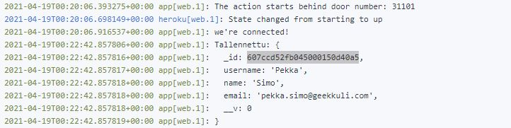
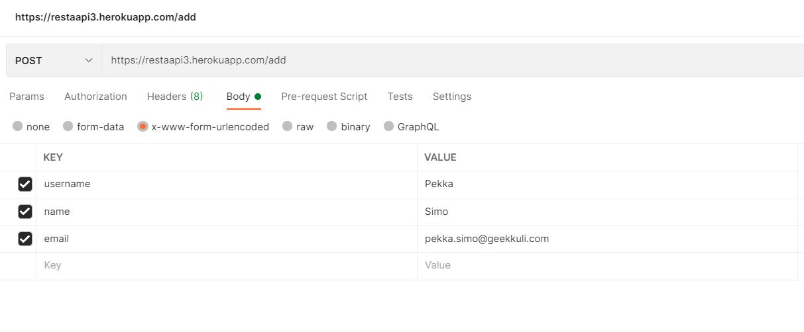
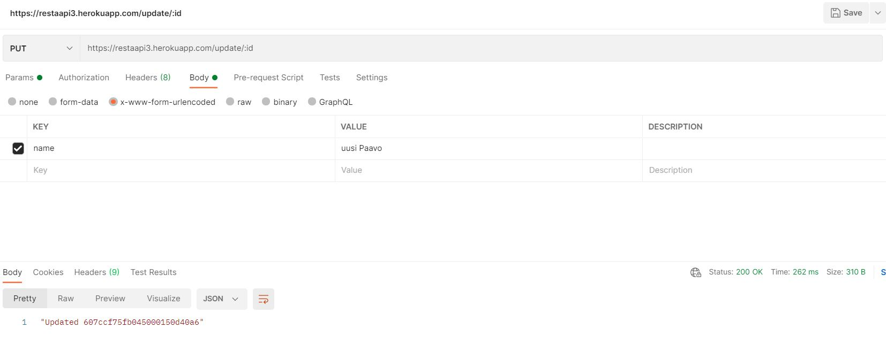
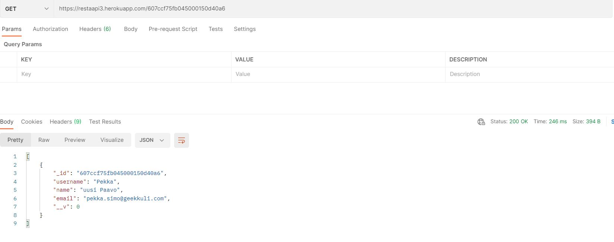
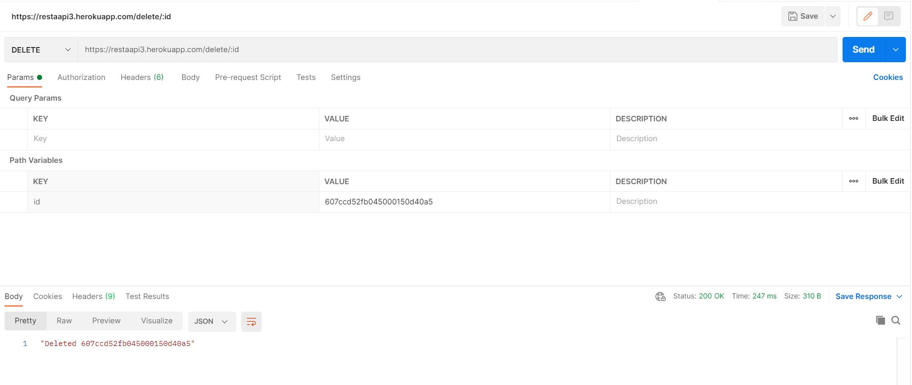
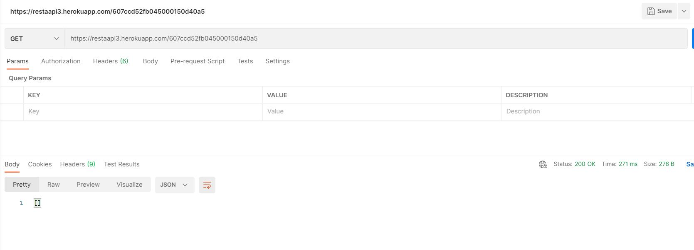

# Project 3: REST API
Web developing with MERN-stack 2021
## Project environment in [Heroku](https://restaapi3.herokuapp.com/) 
- 5+ routes, JSON , handle errors.
- API DB queries with [Mongoose](https://mongoosejs.com/).
- Test with [POSTMAN](https://www.postman.com/) or [CURL](https://curl.se/)
- Publish in [Heroku](https://www.heroku.com/), [Vercel](https://vercel.com/) or similar.
- Source code in 
- Comment your code
- Provide README in the repository with URL:s and other info
----
Teemu Näsänen
[Laurea University of Applied Sciences](https://www.laurea.fi/en/)
----

